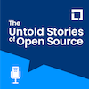

# The Untold Stories of Open Source

Open Source is embedded in every software application you touch today.

It’s impossible to build a large scale application without it. The real question is, what’s the story behind that component, application, or framework you just downloaded? Not the specs. Not the functionality. The real story: “Who wrote the code? What is their backstory? What led them to the Open Source community?”

From the Linux Foundation office in New York City, welcome to "The Untold Stories of Open Source". Each week we explore the people who are supporting Open Source projects, how they became involved with it, and the problems they faced along the way.

## Latest Episodes and More!

Find the latest Linux Foundation episodes and more below ...

# Linux Foundation Community Podcasts

Listen to the latest episodes from The Linux Foundation ["The Untold Stories of Open Source"](https://untold-stories-of-open-source.captivate.fm/spotify) podcast below.

| Episode                                                                                                                                                  | Title                                                                                                        | Play Podcast                                                  |
| -------------------------------------------------------------------------------------------------------------------------------------------------------- | ------------------------------------------------------------------------------------------------------------ | ------------------------------------------------------------- |
|                 | [Patrick Debois on the Business of Open Source](docs/podcasts/business-of-open-source.mdx)                   | [>>](https://open.spotify.com/episode/3MKsXkw9Et5B9bGLWKJNpc) |
|                      | [Brian Behlendorf and the OpenSSF Project](docs/podcasts/openssf-project.mdx)                                | [>>](https://open.spotify.com/episode/0P0cjBDn5nSYPe1i0FrFXr) |
|                                     | [Priyanka Sharma, GM, CNCF](docs/podcasts/priyanka-sharma-gm-cncf.mdx)                                       | [>>](https://open.spotify.com/episode/5KgqNXHHV0y03yjgg7kg8E) |
|  | [An Introduction to the new Podcast from the Linux Foundation](docs/podcasts/introduction-to-lf-podcast.mdx) | [>>](https://open.spotify.com/episode/62DAkdeQTSAPeLbxF2sTlX) |

## Listen in your Browser

Listen to Linux Foundation podcasts in your browser by visiting the [LF Community Podcast Microsite](https://fanciful-salmiakki-90bec2.netlify.app/).

## What the project does

The Linux Podcast Project is a public podcast, highlight projects and people using open source. In addition, the podcast will regularly feature updates on project from project leads and contributors

https://user-images.githubusercontent.com/6029572/165733019-648c3990-6c8b-45e6-a5c4-f4ec58ff2eee.mp4

## Why the project is useful

The podcast is used to inform the Linux and Open Source communities as to the current state in development of open source initiatives and Linux Foundation Projects. It is vendor neutral, with no interviews of commercial product vendors or sales teams.

## How users can get started with the project

The easiest way to keep track of the project is through subscription to the podcast series (TBD). You will be notified of new podcasts, which will be distributed on all major podcast networks

## Where users can get help with your project

Questions and comments are welcome, especially suggestions for upcoming shows.

## Who maintains and contributes to the project

Mark Miller, VP, Community and Outreach 
Executive Director, Linux Podcast
